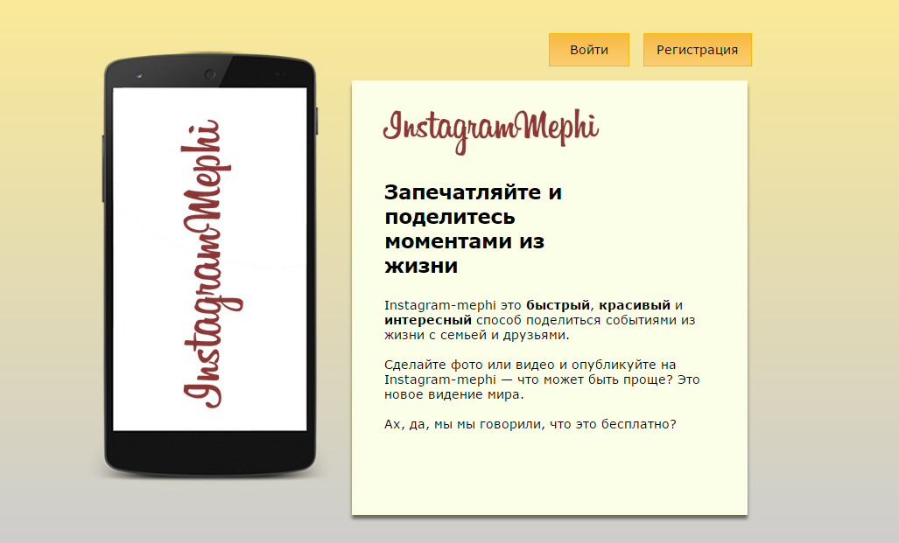
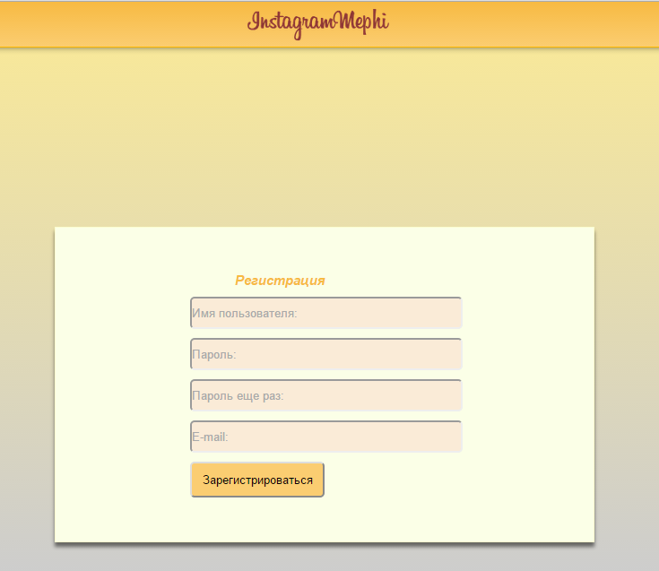
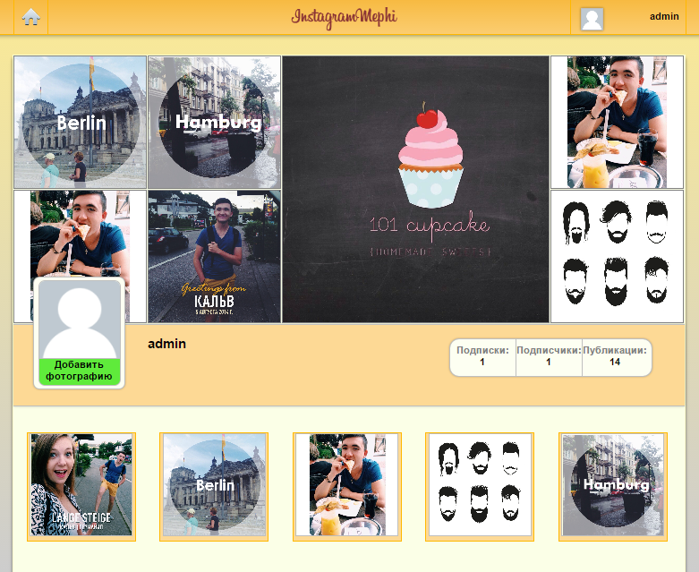
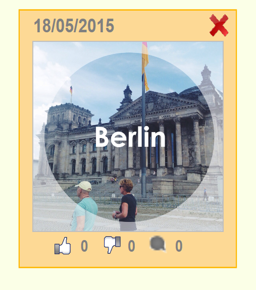
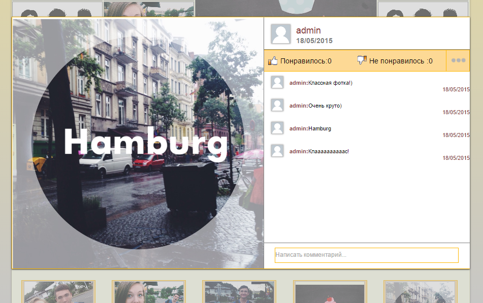
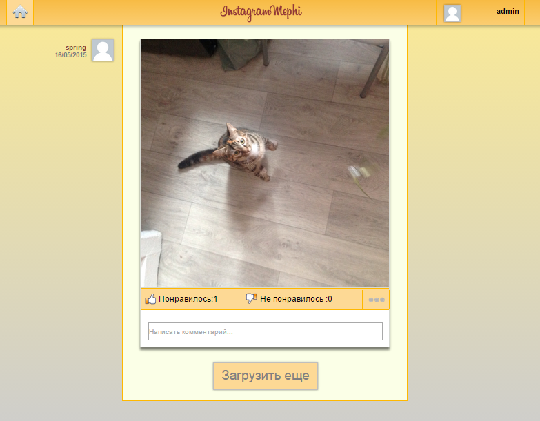

# Instagram MEPhI

Проект "Instagram MEPhI" был разработан в учебных целях в 2015 году студентами 2-го курса НИЯУ МИФИ. Проект представляет собой в каком то смысле копию популярной социальной сети Instagram.
При разработке использовались Django REST Framework и AngularJS.

**[Презентация](./Presentation/Presentation.pdf)**

# Демонстрация

### Начальная страница
***

    

### Регистрация
***

    

### Профиль пользователя
***

    

### Публикация
***

  
  

### Открытая публикация
***

    

### Лента публикаций
***

    

